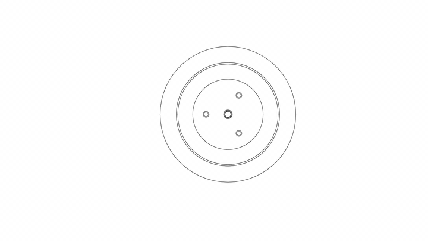

# theta0

Open-source quasi-direct-drive BLDC actuator, modeled after Ben Katz's 2018 thesis on low-cost modular actuators for dynamic robots.

## Files

- `theta0.f3z` — Fusion 360 archive (editable source)
- `theta0.step` — neutral CAD interchange (any CAD tool)
- `theta0.3mf` — mesh for 3D printing
